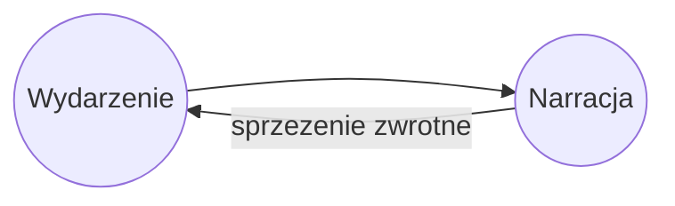
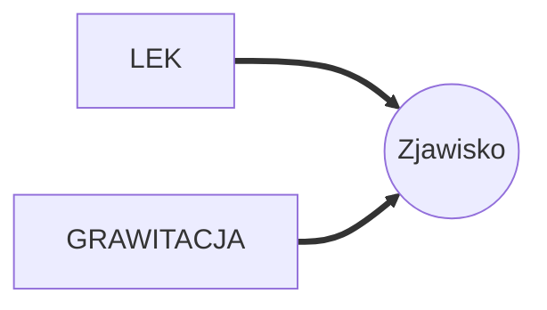
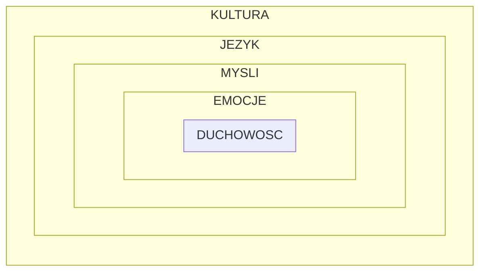

# Wyższe Ja edycja 3 notatki

https://www.jakubbbaczek.pl/szkolenia/wyzsze-ja/

# Agenda

1. [Wstęp](#Wstęp)
2. [Autentyczność](#Autentyczność)
    - [Ćwiczenie autentyczności](#Ćwiczenie autentyczności)
3. [Wydarzenie czy Narracja](#Wydarzenie czy Narracja)
    - [Ćwiczenie Wydarzenie kontra Narracje](#Ćwiczenie Wydarzenie kontra Narracje)
    - [Ćwiczenie opisanie jak odczuwamy w ciele trudne sytuacje](#Ćwiczenie opisanie jak odczuwamy w ciele trudne sytuacje)
    - [Ćwiczenie: Drzewo dusz](#Ćwiczenie Drzewo dusz)
4. [Adaptacja](#Adaptacja)
    - [Ćwiczenie Co cię ukształtowało?](#Ćwiczenie Co cię ukształtowało?)
5. [Lęk](#Lęk)
    - [Ćwiczenie z lęku w parze](#Ćwiczenie z lęku w parze)
    - [Ćwiczenie z kartką](#Ćwiczenie z kartką)
6. [Mury wokół duchowości](#Mury wokół duchowości)
   - [Ćwiczenie wyzwolenie od emocji](#Ćwiczenie wyzwolenie od emocji)

# Wstęp

Zacznij sobie od zadania pytania:
> Czy życie jest tak satysfakcjonujące, jak mogłoby być?

Często w codzienności dopada nas zniechęcenie, odrzucenie. Samo osiąganie celów również okazuje się
pułapką, jeśli nie spełnia potrzeb serca.

Na `Wyższe Ja` składają się:

- Szczęście
- Moc sprawcza (~ masz wpływ na reakcje, mimo że nie na bodźce )
- Samorealizacja (~ świadomość automatyzmów, które zachodzą)

To, co dostarcza nam świat - powinniśmy przyjąć, bo lepszego nie będzie. ***Zmiany możemy dokonać w sobie***

Ta sama okoliczność może być dla Ciebie wybawieniem albo więzieniem. (Patrz porównanie celi klasztornej
i więziennej). Wszystko zależy od tego, czy lubisz swoje życie.

# Autentyczność

Warunkiem koniecznym, by żyć pełnią życia jest: `AUTENTYCZNOŚC`.

* Należy przy tym uważać na tzw `Blind spots` - wyparte pragnienia, które nie są nawet dla nas samych
  ujawnione.

## Ćwiczenie autentyczności

1. Aby pomóc sobie w byciu autentycznym, poświęć najpierw 2 minuty wypełnienie tego formularza. Ułatwi Ci to  
   odkrycie w sobie autentyczności.

   > Od dłuższego czasu udaję, że ...  
   > Gdy tymczasem ...  
   > Ta nieautentyczność powoduje, że ...  
   > Przez to brakuje mi w życiu ...  
   > Stwarzam dla siebie nową możliwość i jest to ...

2. Następnie powiedz to na głos albo najlepiej drugiej osobie, z którą możesz wykonać to ćwiczenie
3. Pytania pomocnicze:
    - Co możesz zrobić, aby to się wydarzyło ?
    - Czy znasz jakiś sposób, który dodałby Ci odwagi?
4. Jeśli temat, który poruszyłeś w tym ćwiczeniu, jest związany z osobą Ci bliską **!!!przedzwoń do niej!!!**. I powiedz
   to co tu napisałeś. ***Rozwój jest wtedy, kiedy wali Ci serce***.
    - często to jedna z nielicznych szans na to, by w końcu być szczerym.

# Wydarzenie czy Narracja

> Stań na boisku, a nie na trybunach swojego życia !

Często na drodze do szczęścia stoją narracje. Ale jak je odróżnić ?

| WYDARZENIE                    | NARRACJA                                          |
|-------------------------------|---------------------------------------------------|
| - nie da się zmienić          | - da się zmienić                                  |
| ---                           | ---                                               |
| Przykład:                     | Przykład narracji blokującej przed dobrym życiem: |
| ktoś się spóźnił na spotkanie | nie jestem dość dobry                             |
| ktoś ma inne zdanie ode mnie  | najważniejsze unikanie konfliktu                  |
|                               | ktoś mnie zdemaskuje                              | 
|                               | nie jestem ciekawy                                |
|                               | nie jestem towarzyski                             | 
|                               | jestem gorszy od innych                           | 

***Narracja często nas blokuje, naszą samorealizację !*** Przez to żyjemy w iluzji. Iluzji,
którą sami sobie wytworzyliśmy.

#### Narrację można zmienić !

## Ćwiczenie Wydarzenie kontra Narracje

1. Weż na tapet jedną z sytuacji, które w Twoim życiu miały/mają miejsce. I oddziel wydarzenie
   od narracji. Czas ~2 min.
2. Poproś 2 osobę, opowiedz jej o tym zdarzeniu i spróbujcie razem ustalić co było wydarzniem, a co narracją
3. Pytania pomocnicze:
    - Co by się mogło wydarzyć, jakbyś był/-a wolny od tej narracji?
    - Przeszłość należy zostawić tam, gdzie jej miejsce, w przeszłości. Czy jakbyś potrafił się od niej odciąć
      coś by się zmieniło?
4. Zmień narrację.
    - zastanów się jaką inną narrację mógłbyś przyjąć w tej sytuacji?
    - czy byłaby ona mniej prawdziwa? Czy gdybyś przyjął inną narrację nie doszłoby do dramatu?
    - Większość dramatów zaczyna się od narracji!

> Często jak się rozkręca nowy Biznes to mamy 2 typy ludzi:   
> idealistę - człowieka z głową w chmurach ale wolnego od narracji oraz  
> człowieka excela  
> Przeważnie lepiej sobie radzą idealiści, gdyż są wolni od narracji i są pełni determinacji by robić rzeczy wielkie

### Ja jako część większej całości

Nie jesteśmy samotną wyspą. Jesteśmy częścią większej całości.

## Ćwiczenie opisanie jak odczuwamy w ciele trudne sytuacje

1. Opisz, co czujesz w ciele, kiedy napotykasz trudną sytuację. Wyobraź sobie tą sytuację.
    - Gdzie to odczuwasz?
    - Czy to przyjmuje jakiś kształt/ formę ?
    - Czy jest to bardziej tętniące czy stałe ?
    - Czy zmienia się z czasem ?
    - Czy się kurczy czy rośnie?
2. Zastanów się, czy forma, którą opisałeś (np kula która Cię dusi), to nie przypadkiem MOTYWATOR DO ZMIANY.
   Nowy scenariusz, który się przed Tobą otwiera?

#### Odpowiedz sobie na pytanie, jakie narracje tworzysz w poszczególnych sytuacjach ?

1. Ja jako jednostka
2. Ja w związku
3. Ja w rodzinie
    - są narracje np: jak uciec
4. Ja w firmie
    - co sobie opowiadasz?
5. Ja w grupie
    - silna potrzeba na zasłużenie w grupie
    - ewolucyjne podwaliny potrzeby afiliacji
    - strach przed odrzuceniem
6. Ja w społeczeństwie
7. Ja w Polsce
8. Ja w Europie
9. Ja w Świecie
10. Ja w transcendencie

## Ćwiczenie Drzewo dusz

Największy wpływ mają na nas osoby, którym nadajemy znaczenie.

1. Narysuj swoje drzewo dusz.
2. Wybierz formę, jaka Ci odpowiada: Niektórzy rysują grafy, inni mapy.
3. Osoby, które do niego zaprosisz, powinny mieć na Ciebie największy wpływ.
4. Ponieważ sam nadałeś im znaczenie, zastanów się, czy z jakimiś osobami mógłbyś mieć lepsze relacje.

> Jeśli chcesz iść szybko - idź sam.  
> Jeśli chcesz iść daleko - idź w grupie.

# Adaptacja

Człowiek podczas swojego życia przechodzi przez około 7 kryzysów. Każdy z takich kryzysów powoduje
że po tym przykrym zdarzeniu nie jesteśmy tacy jak przed nim. Wyzwala w nas zmianę.

Taka zmiana nazywana jest `Adaptacją` i pozwoliła nam przetrwać. (Jest też tajemnicą sukcesu ludzkiego gatunku).

Jednak nie możemy do niej podchodzić bezrefleksyjnie. Schematy, które stosowaliśmy wcześniej mogą już
nie zdawać egazminu, albo mają ogromy wpływ na nasze dalsze życie.

Ważne jest to byśmy sobie uświadomili, że schemat działania możemy **zmienić**

## Ćwiczenie Co cię ukształtowało?

Skupmy się teraz na 3 kryzysach, które przeżyłeś:

1. kryzys dziecięcy (~7 - 10 lat)
2. kryzys adolescencji (~ 13 - 17 lat) (przynależność do grupy)
3. kryzys dzieciństwa

Poświęć na każdy z nich 2-3 minuty i opisz w poniższej formie:

Format:

| Co się stało ? | Jaki musiałeś/łaś się stać ?   | 
|----------------|--------------------------------|
| picie herbaty  | pokorny / posłuszny / bezwolny |

Pytania pomocnicze:

- Jaki musiałeś się stać ?
    - Czy to nie jest przemoc?
    - Czy to nie jest skłanianie do poczucia winy?
    - Czy komuś wygodnie w roli cierpienia?
    - Czy by zwrócić czyjąś uwagę trzeba popychać się do ekstremum?
- Czy dalej używasz tego schematu?
- Co innego można by zrobić w tej sytuacji?
- Jakie to by było dla Ciebie, gdybyś nie musiał już tak robić?
- Masz wybór! Czy chciałbyś teraz zadziałać inaczej? Czy chcesz by to zmienić?
- Co musi się wydarzyć by to się zmieniło

> Nikt tego nie zrobi za Ciebie! Wybierz sam swój scenariusz
>
> Kto mnie akceptuje - super, kto mnie nie akceptuje to do widzenia!
>
> Jak Wy za sobą nie staniecie to nikt za Wami nie stanie.

### Narracje po adaptacjach

Często dane trudne wydarzenie wraz z narracją tworzy sprzężenie zwrotne. Poprzez wyjście
z narracji są możliwe inne scenariusze.

# Lęk

Lęk który jest motywatorem:

- przed zmianą
- przed prawdą
- przed oceną społeczną
- przed innymi ludźmi

> Daj ludziom przestreń na bycie autentycznym, za drzwiami lęku nie ma nikogo.

> Nie analizuj. Bądź!
> Wyłącz rozsądek i rozumowanie.

## Lęk i grawitacja to zjawisko

Nie mamy pretensji do grawitacji, że istnieje. Nie słychać na ulicy, nie zrobię czegoś, bo strasznie
działa na mnie grawitacja. Tak samo jest z lękiem. Wszyscy go odczuwamy i nie zmienimy tego.
Potraktuj więc lęk jak normalne zjawisko i coś, na co nie masz wpływu.

## Ćwiczenie z lęku w parze

1. Co by się zminiło, gdyby tylko zauważyć lęk, a nie nadawać mu narracji?

Luźne wnioski:

- Nie kłam i angażuj się w życie.
- Wyparcie / unikanie nie zmieni nic w Twoim życiu
- Nie masz wpływu na kogoś, ale możesz zawsze wybaczyć / zaakceptować
- Wybaczenie > Unikanie
- Trudni ludzie to ci sai co potrzebują miłości
- Za egotyzmem i manią wielkości kryje się lęk i brak poczucia wartości. To doskonałe miejsce na empatię
- Narcyzm to podszyty lęk o to że jest się zwyczajnym.

> Za pozorną obojętnością czai się tęsknota.

## Ćwiczenie z kartką

Napisz list do osoby z [Twojego drzewa dusz](#Ćwiczenie Drzewo dusz), z którą nie czujesz integralności i chciałbyś to
naprawić.
Możesz posłużyć się częściowo formułką z [ćwiczenia autentyczności](#Ćwiczenie autentyczności).

# Mury wokół duchowości

> Współczesny świat potrzebuje innych liderów niż jeszcze 5 10 15 lat temu. Kiedyś lider musiał być specjalistą, póżniej
> musiał umieć zarządzać, a w dzisiejszym świecie coraz częściej do przewodnictwa potrzebne jest serce, zrozumienie i
> wsparcie.

Mury zasklepiają naszą duchowość. Naszą drogę do:

- samoekspresji
- samorealizacji
- satysfakcji

Na nasze mury składają się: 

## Wyzwolenie od emocji
## Ćwiczenie wyzwolenie od emocji

Emocje i uczucia są prawdziwe, ale nie zawsze są trafne.  
Przykład: 
`Lęk nieadekwatny do rzeczywistości`
- boimy się wziąć od rynku więcej
- jak nie zbierzesz energii z rynku, to wypalisz się !! 
- Czego ja chcę? Ile chcę zarabiać?  
  
  

1. Przyglądaj się emocji, to ona zniknie.
   1. Przykład: Żałoba / choroba  
      - źle: `Nie martw się, wszystko będzie dobrze!`
      - dobrze: `Bądź w smutku tyle ile potrzebujesz`
   2. Przykład: Złość przychodzi
     - źle: `zduś w sobie gniew` on i tak do Ciebie wróci, gdy będziesz mieć słabszą samokontrolę
     - dobrze: `miej ten gniew i go wyartykułuj`

Emocje to przeszkoda przed duchowością. Warto pamiętać, że czasem się zgadzają z rzeczywistością, ale najczęściej 
to zbieg okoliczności.

## Wyzwolenie od myśli

Często naszym przeciwnikiem jest `umysłowa twierdza` - liczne wymówki: 
 - próbowałem wszystkiego
 - znam te metody, już o tym czytałem 
 - ja nie mam czasu
 - nie po to robiłem magistra by się bawić w duchowość

#### Czy brak działania oparty o wymówki może zmienić życie? 

> Marzenia się nie spełniają. Marzenia się spełnia

Potraktuj swoje porażki jak schodki do swojego szczęścia. 

## Wyzwolenie od języka
Język również może być murem.
To jakich słów używamy/ jakich narracji wobec siebie ma zasadnicze znaczenie. I możemy to zmienić.

## Wyzwolenie od kultury 
Kultura narzuca pewien schemat, który jest w danej chwili dobry dla społeczności, ale nie koniecznie dla Ciebie.
1. Ponadto to, co w jednej kulturze jest zasadne w drugiej jest niedopuszczalne
2. Z biegiem czasu reguły w kulturze się zmieniają.

Przykładem niech Ci będą ludzie - dziwacy - są inni niż reszta społeczeństwa. Zachowują się inaczej. Nie patrzą 
na kulturę, język itp. 
  
Mikołaj Kopernik był dziwakiem.  
Elon Musk jest dziwakiem.  
  
**Dziwacy zmieniają świat!** 

Rób wyższe standardy, niż narzuca kultura.

> Im więcej wymówek tym niej działania.  
> Im niej wymówek tym więcej dzaiłania.
  
Zastanów się: 
- pojawia się jakaś niepowtarzalna szansa
- myślisz o zmianie pracy
- chcesz namówić połówkę na wycieczkę
Pojawiają się rozważania i wymówki.  
Jak myślisz? Szanse na działanie rosną czy maleją ? 